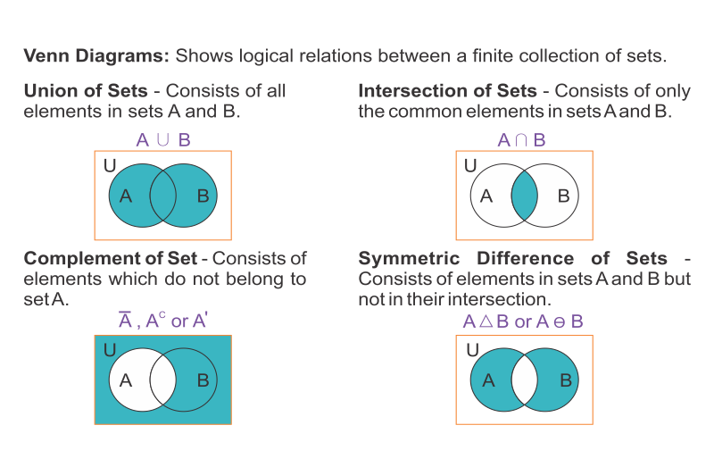

# dismathportfolio-FaeSerrano
dismathportfolio-FaeSerrano created by Classroom for GitHub

#Week 1
- Introduction to Discrete Mathematics DISMATH: it was tricky and interesting. 
- We should learn to think critically in this subject.
- Example problems about knights and knaves: I got the hang of it and capture my interest in the subject.
- There are several types of truth such as scientific truth and legal truth however Dismath only deals with mathematical truth.
- I was introduce to **propositions** 
  - it is a declarative statement that can be answered by true or false
  - not proposition: "x + 1 = 11"
  - propsition: "x + 1 = 11 at x=3"
- My first encounter with symbols like  ¬  and ⊕ and they are called logical connectives where ¬  is for Negation, ∧ is for conjunction, ∨ is for disjunction,⊕ is for exclusive disjunction, → is for implication, and ↔ is for biconditional.

| **Logical Symbol**  |  **Logical Operator** | **Shorthand** | **Formula** | **Logical Expression** |
| :-----: |:-------:|:-----:| :-------: | :-------: |
| ¬ |Negation | not | val(¬p) = 1 - val(p) | ¬p |
| ∧ | Conjunction | and | val(p ∧ q) = min(val(p), val(q)) | p ∧ q |
| v | Disjunction | or | val(p v q) = max(val(p), val(q)) | p v q |
| ⊕ | Exclusive disjunction | xor | if val(p)  not equal val(q) = 1 , otherwise  0|  p ⊕ q  ≡ (¬p ∧ q) v (p ∧ ¬q) |
| → | Conditional | if, then | if val(p)  ≤ val(q) = 1 , otherwise  0  | p → q ≡  ¬p v q |
| ↔ | Biconditional | iff | if val(p) equals val(q) = 1 , otherwise  0 |  p ↔ q ≡ (p → q) ∧ (q → p) |

Propositional Logic
  - The contrapositive of the statement is also equivalent of the original statement
  
| Propositional Logic |  |
| :-------: | :-------:  |
| Inverse of p → q        | ¬p → ¬q|
| Converse of p → q       | q → p  |
| Contrapositive of p → q | ¬q → ¬p|

#Week 2
- Ive learned that superman does not exist!

- I learned that instead of creating a truth table *(I must admit it can be tiresome especially with plenty of variables)* we can use logical equivalences instead.
  - Laws such as Associative, Distributive and Commutative are already familiar through algebra lessons.
  - Learned new laws such as De Morgan's law, absorption, domination and idempotent laws.

|         Name        |                           Equivalence                          |
|:-------------------:|:--------------------------------------------------------------:|
|    Identity laws    |                      p ∧ T ≡ p p v F ≡ p                    |
|   Domination laws   |                       p v T ≡ T p ∧ F ≡ F                   |
|    Negation laws    |                     p v ¬p ≡ T p ∧ ¬p ≡ F                   |
| Double negation law |                            ¬(¬p) ≡ p                           |
|   Idempotent laws   |                       p v p ≡ p p ∧ p ≡ p                   |
|   Commutative laws  |                   p v q ≡ q v p p ∧ q ≡ q ∧ p               |
|   Associative laws  |       (p v q) v r ≡ p v (q v r) (p ∧ q) ∧ r ≡ p ∧ (q ∧ r)   |
|  Distributive laws  | p v (q ∧ r) ≡ (p v q) ∧ (p v r) p ∧(q v r) ≡ (p ∧ q) v (p ∧ r) |
|   De Morgan's laws  |              ¬(p ∧ q) ≡ ¬p v ¬q ¬(p v q) ≡ ¬p ∧ ¬q          |
|   Absorption laws   |                 p v (p ∧ q) ≡ p p ∧ (p v q) ≡ p             |

- I **really** enjoyed proving logical statements :)
- End of proposition logic
- Start of predicate logic
  - I've already encountered the word predicate in english class.
  - It is amazing how other terms can be applied to Dismath.
  - concern in internal structure in terms of subject and predicate.
- Quantifiers has two kinds: Universal and Existensial.
  - Universal  (∀x) - should be true to all values.
  - Existensial (∃x) - true to atleast one value.
- I've learned three termonologies about Rules of Inference
  - Argument - sequence of statements that end with a conclusion. Ex. (p1 ∧ p2 ∧ p3 ... ∧ pn) → q
  - Valid -  conclusion of the argument must follow from the true of the preceding statements of the argument. Ex. (p1 ∧ p2 ∧ p3 ... ∧ pn) → q is TAUTOLOGY
    - tautology - statement that is always true.
  - Fallacy - an invalid argument.

#Week 3
- So far, these are the following tools that can be used to prove statements:
  - Truth Table
  - Logical equivalences
  - Quantifiers
  - Rules of Inference

|  **Type**  |  **Rule of Inference**  |  **Tautology**  |
| :-------: | :--------------: | :---------: |
| Modus Ponens |  p, p → q ∴ q  |  (p ∧ (p → q)) → q  |
| Modus Tollens |  ¬q, p → q ∴ ¬p |  (¬q ∧ (p → q)) → ¬p  |
| Hypothetical Syllogism |  p → q, q → r ∴ p → r  |  ((p → q) ∧ (q → r)) → (p → r)  |
| Disjunctive Syllogism |  p ∨ q, ¬p ∴ q  |  ((p ∨ q) ∧ ¬p) → q  |
| Addition |  p ∴ p ∨ q  |  p → p ∨ q  |
| Simplification |  p ∧ q ∴ p  |  (p ∧ q) → p  |
| Conjunction  |  p, q ∴ p ∧ q  |  ((p) ∧ (q)) → (p ∧ q)  |
| Resolution  |  p ∨ q, ¬p ∨ r ∴ q ∨ r  |  ((p ∨ q) ∧ (¬p ∨ r)) → q ∨ r  |

- Introduced to Methods of Proofs:
- The first rule is direct proof
 
- Direct Proof: (p → q)
  - Steps: 
    - Assume p is true
    - Prove that q is also true through step 1
- Had some sample problems that helped undestand better how to use direct proof.

#Week 4
- Proof by Contraposition/Indirect Proof: (p → q ≡ ¬q → ¬p)
  - Steps:
    - Assume ¬q is true
    - Show that ¬p is also true from the previous assumption.
- Vacuous Proof: (¬p → (p → q))
Premise:    ¬p
Conclusion: p → q
  - Show that p is false, because (p → q) must be true when p is false.
- Trivial Proof: (q → (p → q))
  - Show that q is true, then it follows that (p → q) must also be true.
- Proof by Contradiction
  - Steps:
    - Assume that the premise is not true: ¬(premise) ≡ T
    - Show that the assumption will end up in a contradiction.
- Had several examples to better understand the usage of each methods of proof.
- In proving, we must show every step and proof.
- Even assumption should have a corresponding proof to be consider valid.
- Proof by Equivalence
 - Biconditional:  p ↔ q, we show that p → q and q → p 

#Week 5
Cont of methods of proof:
- Had several examples to better understand the usage of Direct and indirect proof.
  - If n is a positive integer, then n is odd if and only if n^2 is odd.
  - For any natural number n, n is even if and only if n^2 is even.
- Counterexample - uses an example to disprove a statement
  - example: Every positive integer is the sum of the squares of two integers
    - Disprove using counterexample: 3
-Mathematical induction - treats the sequence of propositions as a domino
  - Steps:
    - *Basic step* show P(1) is true
    - *Inductive step* Assume P(k) is true
    - show p(k+1) is true
  - QED (quod erat demonstrandum) - signals the end of proof
  - Example: Prove P(n) = 1 + 2 + 3 + … + n = n(n+1)/2
  

#Week 6
- SUMMATION - notation for sum of am, am+1, ..., an is ∑ai=m ai where i is the index of summation.
  - Σ “sigma”
- RECURSIVE/INDUCTIVE DEFINITION
  - 1. Basis step: specify the value at zero
  - 2. Recursive step: Find a rule for finding its value at an integer number from the values at smaller integers.
  - example: f(0) = 3, f(n+1) = 2f(n) + 3
- RECURSIVE ALGORITHM - solves a problem by reducing it to an instance with smaller input

- PROGRAM CORRECTNES - to ensure that a program gives the correct output
  - PROGRAM VERIFICATION - A program is said to be correct if it produces the correct output for every possible input.
    - 1. Show that the correct answer is obtained if the program terminates.(Partial correctness)
    - 2. Show that the program always terminates
  - PARTIAL CORRECTNESS
    - initial assertioN (p)- gives the properties that the input values must have.
    - final assertion (q) - gives the properties that the output of the program should have, if the program did what was intended.
- HOARE TRIPLE p{S}q
  - S is said to be partially correct with respect to the initial assertion p and the final assertion q if whenever p is true for the input values of S and S terminates, then q is true for the output values of S

- **RULES OF INFERENCE**
 - *COMPOSITION RULE*  
  p{S1}q  
  q{S2}r  
  ______________  
   ∴ p{S1;S2)r  
  - *CONDITIONAL STATEMENTS*  
  (p ∧ _condition_) {S} q  
  (p ∧ _¬condition_) → q  
  ________________________________________ 
    ∴ p {**if** _condition_ **then** _S_} q
  - *IF-ELSE STATEMENT*  
  (p ∧ _condition_) {S1} q  
  (p ∧ _¬condition_) {S2} q  
  _____________________________________  
    ∴ p {*if* _condition_ *then* _S1_ *else* _S2_} q

- POWER SERIES
  - ∑∞n = 0 anxn ;  where a0, a1, a2, ... is a given sequence of constants, and x is a real variable.
  - Examples:   1 + r + r2 + r3 + ... = 1/(1-r)

#Week 7
- Project 0.0:
 - To be passed next week, March 2, 2016
 - Individual
 
- SET THEORY
  - A set is an unordered collection of distinct objects, which may be anything (including other sets).
    - {f, a, e, n, i, c, l}
  - Empty Set { } = ∅ means no elements
    - {∅} not an empty set
  - Set Builder Notation {x | some property that x satisfies}
  - Membership
    - 1 ∈ {1, 2, 3, 4}
  
- **VENN DIAGRAM**

- **SET IDENTITIES TABLE**

|  **LAW**  |  **IDENTITY**  |
| :------: | :-----------------------------: |
|  Identity Laws  |  A ⋂ U ≡ A     A ⋃ ∅ ≡ A  |
|  Domination Laws  |  A ⋃ U ≡ U     A ⋂ ∅ ≡ ∅  |
|  Idempotent Laws  |  A ⋃ A ≡ A     A ⋂ A ≡ A  |
|  Complementation Law  |  (A¯)‾ ≡ A  |
|  Commutative Laws  |  A ⋃ B ≡ B ⋃ A     A ⋂ B ≡ B ⋂ A  |
|  Associative Laws  |  A ⋃ (B ⋃ C) ≡ (A ⋃ B) ⋃ C     A ⋂ (B ⋂ C) ≡ (A ⋂ B) ⋂ C  |
|  Distributive Laws  |  A ⋃ (B ⋂ C) ≡ (A ⋃ B) ⋂ (A ⋃ C)    A ⋂ (B ⋃ C) ≡ (A ⋂ B) ⋃ (A ⋂ C)  |
|  De Morgan's Laws  |  (A ⋂ B)‾ ≡ A‾ ⋃ B‾     (A ⋃ B)‾ ≡ A‾ ⋂ B‾  |
|  Absorption Laws  |  A ⋃ (A ⋂ B) ≡ A     A ⋂ (A ⋃ B) ≡ A  |
|  Complement Laws  |  A ⋃ A‾ ≡ U     A ⋂ A‾ ≡ ∅  |

- SUBSETS ⊆
  - A set S is a subset of a set T (denotes S ⊆ T) if all elements of S are also elements of T
  - Example:  ℕ ⊆ ℤ (every natural number is an integer)
- POWER SET P(S) = {T|T ⊆ S} - A set of all subsets.
- CARDINALITY |S| - The number of element it contains
    - Infinite Cardinalities - alaph-null (0,1,2,3,...)
  
- **FUNCTIONS**
  - Let A and B be sets. A function f from A to B is an assignment of exactly one element of B to each element of A.
  -  Functions are also called MAPPINGS or TRANSFORMATIONS.
    - f: A to B  
       A: domain  
       B: co-domain
    - Range - actually occuring values
    - IMAGE
      - If _f(a) = b_, _b- is the image of _A_.
      - The range of _f_ is the set of all images of elements of _a_.

- **TYPES OF FUNCTIONS**
    - One - to - one Function (Injection)
      - functions that never assign the same value to two different domain elements.
    - Onto Function (Surjective)
      - functions have equal range & co-domain.
    - One - to - one Correspondence (Bijection)
     - function is both one - to - one and onto.

# Week 8:

- ALGORITHMS - A finite set of precise instructions for performing a computation or for solving a problem.
    - *Properties of Algorithms*
      - INPUT - has input values from a specified set 
      - OUTPUT - solution to the problem 
      - DEFINITENESS - defined precisely 
      - CORRECTNESS - produce the correct output values 
      - FINITENESS - produce the desired output 
      - EFFECTIVENESS - perform exactly and in a finite amount of time 
      - GENERALITY - applicable for all problems of the desired form
- PSEUDOCODE
    - high - level desciption of an algorithm that uses the structural conventions of a programming language 
    - intended for human reading
    - Preconditions - describe valid input
    - Postconditions - conditions that the output should satisfy
- Algorithm example: Finding the Maximum {5,4,1,8,3}
  - Input: ({a1, a2, a3,..,an} ∈ , Z)
  - Output: largest 8
  - Pseudocode

    > max = a1;  
    > for i: 2 to n {  
    >   if(max < ai)  
    >       max = ai}  

# Week 9:

- Discussed the types of algorithm procedures that we can use when writing a pseudocode

- SEARCHING ALGORITHMS - Problem of locating an algorithm in an ordered list
    - Linear Search -  finding a particular value in a list that checks each element in sequence until the desired element is found
      - input: x
      - ouput: location, i; loc = i if found, loc = -1 if not found
      
      > i=0  
      > while(i < n and x!=a1)  
      >   i=i+1  
      > if i < n then loc = i  
      > else loc = -1  

    - Binary Search - comparing the middle values of a list then repeated until the desired output is found.

- SORTING ALGORITHMS - Problem of assorting elements into increasing order
    - Bubble Sort - compares the first two elements then interchanging them if they are in the incorrect order.
    - Insertion Sort - compares the second element with the first and inserts it before the first element if it is less. Otherwise, it is inserted after the first element.

- GREEDY ALGORITHMS - Algorithms that make what seems to be the "best" choice at each step. Selects the best choice at each step, instead of considering all sequences of steps that may lead to optimal solution
  - Greedy Change-Making algorithm

- Also started on the *Growth of Functions* often described using Big-O Notation

# Week 10:

Continuation:

- Big-O Notation
    - Let f and g be functions from R-R; _f(x)_ is _O(g(x))_ if there are constants C and k such that:
        |f(x)| ≤ C|g(x)| 
    whenever x > k.
    - Example: f(x)=x^2 + 2x + 1; O(x^2); k=1, C=4

- Big-Omega and Big-Theta Notation
    - Big-O Notation does not provide a lowerbound for the size of f(x). 
        - Big-Omega (Big-Ω) - lower bound
        - Big-Theta (Big-Θ) - both upper and lower bound

- Algorithm Time Complexity - can be expressed in terms of the number of operations used by the algorithm when the input has a particular size.
- Division and Modulo Operator
  - let a be an integer and d positive integer. Then there is a unique Q and r with 0 ≤ r < d such that a = dQ + r
  - Q = a div d
  - r = a mod d

# Week 11
No Class (Holy Week)

# Week 2
- **GRAPH THEORY**
- Graph - are discrete structures consisting of vertices and edges that connect these vertices.
- A graph G = (V,E) consists of V, a nonempty set of _vertices (or nodes)_ and E, a set of edges. Each edge has either one or two vertices associated with it, called its _endpoints_. An edge is said to _connect_ its endpoints.
- Isolated - vertex with 0 degree
- Pendant - vertex with one degree

- Hand shaking theory: 2e = ∑deg(v)

- Path - sequence of edges travelling from vertex to vertex along the edges
- Euler Circuit - passess through every edge and goes back to starting point
  - All vertex has a degree of 2
- Euler Path - simple path containing every edge of the graph
  - Exactly 2 vertex has an odd degree
- Hamilton Path - passes through every vertex
- Hamilton Circuit - passes through every vertex then goes back to the starting point
- Matrices of Graphs - 1 for adjacent; 0 for non-adjacent
- Incidence of Matrices - Matric between vertices and edges
- Isomorphism of Graphs - "rubberband"
  - same connection, equal nodes and vertices 

- **PLANAR GRAPH**
- no edges cross in a graph
- Euler's Formula: r = e - v + 2
  - r - regions
  - e - edges
  - v - vertices
- Euler's Characteristic: ℵ = r - |e| + |v| = 2

- **HOMEOMORPHIC GRAPHS**
- can be obtained from the same graph by a sequence of elementary subdivisions
- Elementary Subdivision - everything is planar graph
- Kuratowski's Theorem - nonplanar if and only if it contains a subgraph homeophobic to K3,3 and K5
